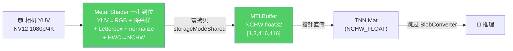
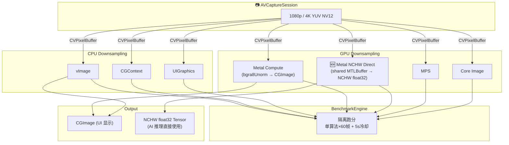
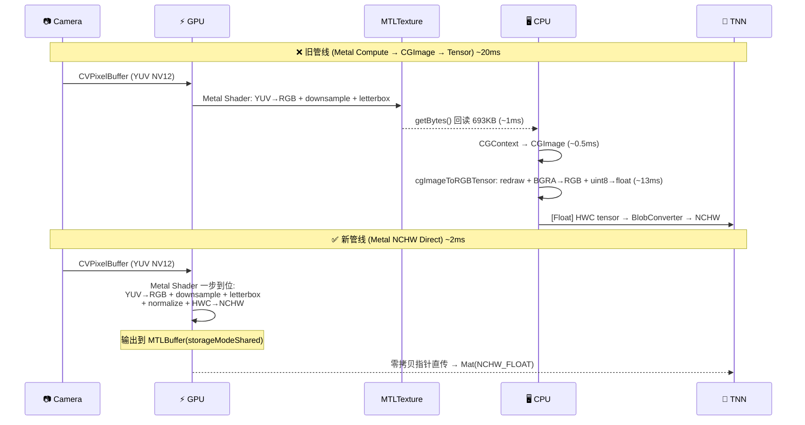

# DownsamplingBenchmark

iOS 实时摄像头采集 → 降采样 → AI 推理预处理，7 种 CPU/GPU 算法的隔离性能对比。

> **测试设备**: iPhone 16 (A18) · iOS 26.3.1 · 全量隔离跑分（单算法运行 60 帧 + 5s 冷却）

---

## 核心结论：Metal NCHW Direct 是 AI 推理预处理的终极方案

真实业务场景：**实时摄像头 → 416×416 Letterbox（等比缩放 + 灰色填充）→ YOLO/目标检测推理**

### 新旧方案一帧预处理耗时对比

| 输入 | Metal NCHW Direct | Metal Compute (旧) | 提升 | vImage | MPS |
|------|-------------------|-------------------|------|--------|-----|
| **1080p → 416² LB** | **~2 ms** | 20.22 ms | **~10x** | 19.65 ms | 27.43 ms |
| **4K → 416² LB** | **~2 ms** | 20.53 ms | **~10x** | 28.76 ms | 27.18 ms |

> ⬆ Metal Compute (旧) 的 20ms 包含了 `cgImageToRGBTensor` 转换（~15ms）。Metal NCHW Direct 在 GPU 上一步完成全部预处理，零拷贝输出。

### 为什么快 10 倍？新旧管线架构对比

#### 旧管线：Metal Compute → CGImage → Tensor（~20ms）


#### 新管线：Metal NCHW Direct → 共享内存 → 推理（~2ms）



**省掉的步骤：** `getBytes` → `CGContext` → `CGImage` → `cgImageToRGBTensor` → `BlobConverter`

### 耗时分解

| 步骤 | 旧管线 | 新管线 (NCHW Direct) |
|------|--------|---------------------|
| CVPixelBuffer → Metal 纹理 | ~0 ms | ~0 ms |
| GPU Shader 执行 | ~2 ms | ~2 ms |
| texture.getBytes (GPU→CPU) | ~1 ms | **0 ms** (共享内存) |
| CGContext → CGImage | ~0.5 ms | **0 ms** (不需要) |
| cgImageToRGBTensor (BGRA→RGB float) | ~13 ms | **0 ms** (GPU 已完成) |
| BlobConverter (HWC→NCHW) | ~1-2 ms | **0 ms** (GPU 已完成) |
| **总计** | **~18-20 ms** | **~2 ms** |

```
一帧预处理耗时 (4K → 416×416 Letterbox):

Metal NCHW Direct  ██░░░░░░░░░░░░░░░░░░   ~2 ms   (🏆 10x 提升)
Metal Compute      ████████████████████░  20.53 ms  (旧方案)
vImage             ████████████████████░  28.76 ms
MPS                ████████████████████░  27.18 ms
CGContext          ████████████████████░  25.32 ms
```

---

## 原始降采样算法基准（不含 tensor 转换）

> 以下数据为纯降采样输出 CGImage 的耗时，不含 `cgImageToRGBTensor` 步骤

| 输入 | 冠军 | 耗时 | FPS | CPU 占用 | 内存 |
|------|------|------|-----|---------|------|
| **1080p** | **Metal Compute** | **4.93 ms** | **203** | **18.5%** | 254 MB |
| **4K** | **Metal Compute** | **5.48 ms** | **183** | **20.7%** | 247 MB |

```
1080p Letterbox → 416×416 (降采样部分):
Metal Compute  ████████░░░░░░░░░░░░   4.93 ms  (最快, 203 FPS)
vImage         ██████████░░░░░░░░░░   6.22 ms  (1.26x)
Core Image     ██████████████████░░  11.21 ms  (2.27x)
CGContext      █████████████████░░░  10.88 ms  (2.21x)
UIGraphics     █████████████████░░░  11.05 ms  (2.24x)
MPS            ████████████████████  13.62 ms  (2.76x)

4K Letterbox → 416×416 (降采样部分):
Metal Compute  ████████░░░░░░░░░░░░   5.48 ms  (最快, 183 FPS)
CGContext      ████████████████░░░░  11.70 ms  (2.13x)
UIGraphics     ████████████████░░░░  11.77 ms  (2.15x)
MPS            ██████████████████░░  13.76 ms  (2.51x)
vImage         ████████████████████  15.04 ms  (2.74x)
Core Image     ████████████████████  15.56 ms  (2.84x)
```

---

## 真实场景基准：416×416 Letterbox（隔离跑分）

> 摄像头 → 保持 16:9 比例缩放至 416×234 → 上下各填充 91px 灰色 → 416×416
>
> 这是 YOLO / SSD / MobileNet 等检测模型的标准预处理流程

### 1080p → 416×416 Letterbox

| 算法 | 类型 | 平均耗时 | 最小 | 最大 | P99 | FPS | 方差 | CPU | 内存 |
|------|------|---------|------|------|-----|-----|------|-----|------|
| **Metal Compute** | GPU | **4.93 ms** | 2.81 | 9.74 | 9.74 | **202.8** | 0.750 | **18.5%** | 253.9 MB |
| vImage | CPU | 6.22 ms | 3.25 | 6.85 | 6.85 | 160.7 | 0.484 | 22.1% | 253.8 MB |
| CGContext | CPU | 10.88 ms | 8.07 | 12.68 | 12.68 | 91.9 | 0.460 | 33.6% | 254.1 MB |
| UIGraphicsImageRenderer | CPU | 11.05 ms | 8.27 | 14.09 | 14.09 | 90.5 | 0.558 | 33.8% | 262.1 MB |
| Core Image | GPU | 11.21 ms | 8.69 | 17.60 | 17.60 | 89.2 | 1.149 | 46.3% | 256.0 MB |
| MPS | GPU | 13.62 ms | 12.04 | 36.34 | 36.34 | 73.4 | **10.710** | 34.7% | 254.2 MB |

### 4K → 416×416 Letterbox

| 算法 | 类型 | 平均耗时 | 最小 | 最大 | P99 | FPS | 方差 | CPU | 内存 |
|------|------|---------|------|------|-----|-----|------|-----|------|
| **Metal Compute** | GPU | **5.48 ms** | 3.46 | 8.19 | 8.19 | **182.6** | **0.347** | **20.7%** | **246.5 MB** |
| CGContext | CPU | 11.70 ms | 10.68 | 31.99 | 31.99 | 85.5 | 8.749 | 32.2% | 246.6 MB |
| UIGraphicsImageRenderer | CPU | 11.77 ms | 10.88 | 32.10 | 32.10 | 85.0 | 8.532 | 32.6% | 278.3 MB |
| MPS | GPU | 13.76 ms | 12.15 | 35.89 | 35.89 | 72.7 | 10.103 | 34.0% | 246.7 MB |
| vImage | CPU | 15.04 ms | 13.10 | 42.06 | 42.06 | 66.5 | 16.587 | 39.9% | 246.5 MB |
| Core Image | GPU | 15.56 ms | 12.15 | 25.88 | 25.88 | 64.3 | 5.283 | **59.2%** | 248.3 MB |

### Letterbox 关键发现

**1. Metal Compute 是唯一「输入无关」的 Letterbox 方案**

| 输入 | Metal Compute | vImage | MPS | 解读 |
|------|-------------|--------|-----|------|
| 1080p (2M px) | 4.93 ms | 6.22 ms | 13.62 ms | — |
| 4K (8.3M px) | 5.48 ms | 15.04 ms | 13.76 ms | — |
| **增长** | **+11%** | **+142%** | **+1%** | MPS 虽然也不涨，但 Letterbox 多步开销高 |

**2. MPS Letterbox 的多步合成瓶颈**

MPS（`MPSImageBilinearScale`）在 Stretch 模式下仅 5~6ms，但 Letterbox 暴涨到 13~14ms。因为 MPS API 只能缩放到目标纹理的完整尺寸，无法指定子区域写入。Letterbox 需要三步：MPS 缩放 → CPU 灰色填充 → GPU Blit 拷贝，CPU-GPU 同步开销是主要瓶颈。

**3. Core Image 在 4K Letterbox 下 CPU 占用最高（59.2%）**

CILanczos 滤镜链（缩放 → AffineTransform → composited）虽然标称 GPU 加速，但 CI 渲染图（render graph）的构建和 JIT 编译在 CPU 端完成，4K Letterbox 的复合滤镜链推高了 CPU 负载。

---

## 416×416 Stretch（直接拉伸，对照组）

> 1080p/4K → 416×416 非等比缩放，作为 Letterbox 的性能基线

### 1080p → 416×416 Stretch

| 算法 | 类型 | 平均耗时 | FPS | 方差 | CPU | 内存 |
|------|------|---------|-----|------|-----|------|
| **MPS** | GPU | **5.39 ms** | **185.5** | 0.738 | 19.2% | 253.7 MB |
| Metal Compute | GPU | 5.46 ms | 183.2 | 1.131 | 19.4% | 252.9 MB |
| vImage | CPU | 5.80 ms | 172.5 | 0.518 | 21.6% | 252.3 MB |
| Core Image | GPU | 10.37 ms | 96.4 | 0.563 | 42.0% | 255.4 MB |
| CGContext | CPU | 13.23 ms | 75.6 | 0.394 | 39.3% | 252.5 MB |
| UIGraphicsImageRenderer | CPU | 13.34 ms | 75.0 | 0.380 | 39.6% | 260.4 MB |

### 4K → 416×416 Stretch

| 算法 | 类型 | 平均耗时 | FPS | 方差 | CPU | 内存 |
|------|------|---------|-----|------|-----|------|
| **MPS** | GPU | **6.06 ms** | **165.0** | 0.518 | 20.4% | 246.5 MB |
| Metal Compute | GPU | 6.10 ms | 164.0 | 0.986 | 20.1% | 246.1 MB |
| CGContext | CPU | 12.63 ms | 79.2 | 12.654 | 34.5% | 246.2 MB |
| UIGraphicsImageRenderer | CPU | 12.73 ms | 78.6 | 12.887 | 34.8% | 277.8 MB |
| Core Image | GPU | 14.91 ms | 67.1 | 4.283 | 52.4% | 248.0 MB |
| vImage | CPU | 15.10 ms | 66.2 | 18.670 | 40.4% | 246.0 MB |

### Stretch vs Letterbox 开销对比

| 方案 | 1080p Stretch | 1080p LB | 额外开销 | 4K Stretch | 4K LB | 额外开销 |
|------|-------------|----------|---------|-----------|-------|---------|
| **Metal Compute** | 5.46 ms | **4.93 ms** | **-10%** | 6.10 ms | **5.48 ms** | **-10%** |
| MPS | 5.39 ms | 13.62 ms | +153% | 6.06 ms | 13.76 ms | +127% |
| vImage | 5.80 ms | 6.22 ms | +7% | 15.10 ms | 15.04 ms | ~0% |
| CGContext | 13.23 ms | 10.88 ms | -18% | 12.63 ms | 11.70 ms | -7% |
| Core Image | 10.37 ms | 11.21 ms | +8% | 14.91 ms | 15.56 ms | +4% |

Metal Compute 的 Letterbox 反而比 Stretch 更快——因为 Letterbox 的实际采样区域（416×234）比 Stretch（416×416）更小，GPU 纹理采样工作量减少。

---

## 全配置冠军矩阵

| 配置 | 输出尺寸 | 冠军 | 耗时 | FPS |
|------|---------|------|------|-----|
| **1080p → 416² Letterbox** | 416×416 | **Metal Compute** | **4.93 ms** | **203** |
| **4K → 416² Letterbox** | 416×416 | **Metal Compute** | **5.48 ms** | **183** |
| 1080p → 416² Stretch | 416×416 | MPS | 5.39 ms | 186 |
| 4K → 416² Stretch | 416×416 | MPS | 6.06 ms | 165 |
| 1080p × 1/8 | 240×135 | MPS | 2.08 ms | 482 |
| 1080p × 1/4 | 480×270 | Metal Compute | 4.55 ms | 220 |
| 1080p × 1/2 | 960×540 | vImage | 6.26 ms | 160 |
| 4K × 1/8 | 480×270 | Metal Compute | 4.93 ms | 203 |
| 4K × 1/4 | 960×540 | MPS | 11.26 ms | 89 |
| 4K × 1/2 | 1920×1080 | vImage | 13.18 ms | 76 |

---

## 比例缩放参考数据

<details>
<summary>1080p × 1/8（1920×1080 → 240×135）</summary>

| 算法 | 类型 | 平均耗时 | FPS | 方差 | CPU | 内存 |
|------|------|---------|-----|------|-----|------|
| **MPS** | GPU | **2.08 ms** | **481.7** | 0.174 | 12.4% | 252.3 MB |
| Metal Compute | GPU | 2.13 ms | 470.2 | 0.327 | 13.3% | 252.5 MB |
| vImage | CPU | 4.99 ms | 200.4 | 0.363 | 19.8% | 253.0 MB |
| CGContext | CPU | 9.73 ms | 102.8 | 0.429 | 30.1% | 253.1 MB |
| UIGraphicsImageRenderer | CPU | 9.92 ms | 100.8 | 0.668 | 30.7% | 261.1 MB |
| Core Image | GPU | 9.92 ms | 100.8 | 0.714 | 42.3% | 252.7 MB |

</details>

<details>
<summary>1080p × 1/4（1920×1080 → 480×270）</summary>

| 算法 | 类型 | 平均耗时 | FPS | 方差 | CPU | 内存 |
|------|------|---------|-----|------|-----|------|
| **Metal Compute** | GPU | **4.55 ms** | **219.7** | 0.829 | 18.1% | 254.1 MB |
| MPS | GPU | 4.75 ms | 210.4 | 0.372 | 17.8% | 252.8 MB |
| vImage | CPU | 5.56 ms | 179.9 | 0.462 | 21.9% | 255.7 MB |
| Core Image | GPU | 9.37 ms | 106.7 | 0.772 | 39.3% | 254.2 MB |
| CGContext | CPU | 11.03 ms | 90.6 | 0.407 | 33.9% | 255.8 MB |
| UIGraphicsImageRenderer | CPU | 11.24 ms | 88.9 | 0.497 | 34.8% | 263.5 MB |

</details>

<details>
<summary>1080p × 1/2（1920×1080 → 960×540）</summary>

| 算法 | 类型 | 平均耗时 | FPS | 方差 | CPU | 内存 |
|------|------|---------|-----|------|-----|------|
| **vImage** | CPU | **6.26 ms** | **159.7** | 4.893 | 26.3% | 250.4 MB |
| Core Image | GPU | 10.19 ms | 98.1 | 5.723 | 35.9% | 259.3 MB |
| Metal Compute | GPU | 10.49 ms | 95.3 | 0.955 | 31.0% | 251.3 MB |
| MPS | GPU | 10.92 ms | 91.6 | 4.863 | 31.6% | 254.1 MB |
| CGContext | CPU | 14.84 ms | 67.4 | 0.451 | 42.8% | 253.0 MB |
| UIGraphicsImageRenderer | CPU | 15.10 ms | 66.2 | 0.386 | 43.3% | 257.0 MB |

</details>

<details>
<summary>4K × 1/8（3840×2160 → 480×270）</summary>

| 算法 | 类型 | 平均耗时 | FPS | 方差 | CPU | 内存 |
|------|------|---------|-----|------|-----|------|
| **Metal Compute** | GPU | **4.93 ms** | **202.6** | 0.526 | 19.0% | 247.3 MB |
| MPS | GPU | 5.04 ms | 198.4 | 0.478 | 18.2% | 246.0 MB |
| CGContext | CPU | 11.59 ms | 86.3 | 9.487 | 32.5% | 249.0 MB |
| UIGraphicsImageRenderer | CPU | 11.78 ms | 84.9 | 9.288 | 32.8% | 280.6 MB |
| Core Image | GPU | 13.54 ms | 73.8 | 3.632 | 51.7% | 247.1 MB |
| vImage | CPU | 13.90 ms | 71.9 | 15.306 | 36.7% | 248.8 MB |

</details>

<details>
<summary>4K × 1/4（3840×2160 → 960×540）</summary>

| 算法 | 类型 | 平均耗时 | FPS | 方差 | CPU | 内存 |
|------|------|---------|-----|------|-----|------|
| **MPS** | GPU | **11.26 ms** | **88.8** | 1.402 | 30.7% | 249.0 MB |
| Metal Compute | GPU | 11.41 ms | 87.7 | 1.682 | 31.6% | 254.8 MB |
| CGContext | CPU | 12.50 ms | 80.0 | 13.972 | 34.7% | 260.9 MB |
| UIGraphicsImageRenderer | CPU | 12.61 ms | 79.3 | 12.797 | 34.8% | 292.5 MB |
| vImage | CPU | 12.79 ms | 78.2 | 15.509 | 34.1% | 260.8 MB |
| Core Image | GPU | 15.89 ms | 62.9 | 2.325 | 46.8% | 253.0 MB |

</details>

<details>
<summary>4K × 1/2（3840×2160 → 1920×1080）</summary>

| 算法 | 类型 | 平均耗时 | FPS | 方差 | CPU | 内存 |
|------|------|---------|-----|------|-----|------|
| **vImage** | CPU | **13.18 ms** | **75.9** | 21.178 | 35.4% | 245.8 MB |
| MPS | GPU | 14.27 ms | 70.1 | 14.608 | 32.7% | 260.9 MB |
| Metal Compute | GPU | 14.50 ms | 69.0 | 13.728 | 33.0% | 253.4 MB |
| Core Image | GPU | 16.29 ms | 61.4 | 7.288 | 35.3% | 277.6 MB |
| CGContext | CPU | 17.09 ms | 58.5 | 19.721 | 46.5% | 246.2 MB |
| UIGraphicsImageRenderer | CPU | 17.46 ms | 57.3 | 19.857 | 47.4% | 278.0 MB |

</details>

---

## 全配置耗时矩阵（ms）

| 算法 | 1080p LB | 4K LB | 1080p 416² | 4K 416² | 1080p ×1/8 | 1080p ×1/4 | 1080p ×1/2 | 4K ×1/8 | 4K ×1/4 | 4K ×1/2 |
|------|----------|-------|-----------|---------|-----------|-----------|-----------|---------|---------|---------|
| Metal Compute | **4.93** | **5.48** | 5.46 | 6.10 | 2.13 | **4.55** | 10.49 | **4.93** | 11.41 | 14.50 |
| MPS | 13.62 | 13.76 | **5.39** | **6.06** | **2.08** | 4.75 | 10.92 | 5.04 | **11.26** | 14.27 |
| vImage | 6.22 | 15.04 | 5.80 | 15.10 | 4.99 | 5.56 | **6.26** | 13.90 | 12.79 | **13.18** |
| Core Image | 11.21 | 15.56 | 10.37 | 14.91 | 9.92 | 9.37 | 10.19 | 13.54 | 15.89 | 16.29 |
| CGContext | 10.88 | 11.70 | 13.23 | 12.63 | 9.73 | 11.03 | 14.84 | 11.59 | 12.50 | 17.09 |
| UIGraphics | 11.05 | 11.77 | 13.34 | 12.73 | 9.92 | 11.24 | 15.10 | 11.78 | 12.61 | 17.46 |

> 全部数据均为隔离跑分模式（单算法 × 60 帧 + 5s 冷却）

---

## 深度分析

### 1. CPU 性能取决于输入尺寸，GPU 取决于输出尺寸

416×416 固定输出提供了最纯粹的对照实验——同一输出、不同输入（1080p vs 4K）：

| 方案 | 1080p → 416² LB | 4K → 416² LB | 增长 | 原因 |
|------|-----------------|--------------|------|------|
| **Metal Compute** | 4.93 ms | 5.48 ms | **+11%** | GPU 纹理采样硬件自动处理 mip-level |
| **MPS** | 13.62 ms | 13.76 ms | **+1%** | GPU 缩放部分不变，但多步合成开销恒定 |
| vImage | 6.22 ms | 15.04 ms | **+142%** | SIMD 遍历全部输入像素，4K 帧超 L2 缓存 |
| CGContext | 10.88 ms | 11.70 ms | +8% | CPU 双线性插值，较轻量 |
| Core Image | 11.21 ms | 15.56 ms | +39% | 滤镜链 JIT 编译 + 输入纹理绑定开销 |

### 2. vImage 的 L2 缓存断崖

| 输入 | 帧大小 vs L2 (16MB) | vImage 排名 | 耗时 |
|------|---------------------|-----------|------|
| 1080p | 8.3 MB < 16 MB ✅ | 第 2 | 6.22 ms |
| 4K | 33.2 MB > 16 MB ❌ | **第 5** | 15.04 ms |

vImage（`vImageScale_ARGB8888`）在 1080p 下仅次于 Metal Compute，但 4K 帧超出 A18 的 L2 缓存后 SIMD 流水线频繁 cache miss，耗时暴涨 2.4 倍。

### 3. MPS 的 Letterbox 瓶颈：从 6ms 到 14ms

| 模式 | 1080p | 4K | 解读 |
|------|-------|-----|------|
| Stretch | 5.39 ms | 6.06 ms | 单步 `MPSImageBilinearScale`，很快 |
| Letterbox | 13.62 ms | 13.76 ms | 三步：MPS缩放 → CPU灰色填充 → GPU Blit |

MPS API 不支持子区域写入，Letterbox 必须走多步流水线。CPU-GPU 同步是主要开销。

### 4. 隔离跑分 vs 真实单任务性能

所有数据均采用隔离跑分模式：每次只运行 1 个算法 + 5 秒冷却。这反映了真实的单任务性能——在实际 App 中，你只会选择 1 种算法运行。

CPU 占用率分布验证了隔离的有效性：

| 算法 | 1080p LB CPU | 4K LB CPU | 解读 |
|------|-------------|-----------|------|
| Metal Compute | **18.5%** | **20.7%** | GPU 主导，CPU 资源充裕给推理 |
| MPS | 34.7% | 34.0% | 多步合成需 CPU 配合 |
| vImage | 22.1% | 39.9% | 4K 时 CPU 负担加重 |
| Core Image | **46.3%** | **59.2%** | GPU 算法中 CPU 占用最高 |

### 5. 方案选择建议

| 场景 | 推荐方案 | 理由 |
|------|----------|------|
| **AI 推理预处理（Letterbox）** | **Metal Compute** | 4.93~5.48ms，CPU 仅 20%，1080p/4K 耗时几乎相同 |
| **AI 推理预处理（Stretch）** | **MPS** | 5.39~6.06ms，Apple 硬件优化，Stretch 模式无短板 |
| **4K 推理 + 合并前处理** | **Metal Compute** | 可在同一 Shader 合并降采样+Letterbox+归一化+色彩转换 |
| 1080p 通用缩放 | vImage | 1080p × 1/2 最快（6.26ms），SIMD 在 L2 内性能极佳 |
| 4K 大输出（4K→1080p） | vImage | 13.18ms，大输出场景 vImage 反超 GPU |
| 简单场景 / 快速原型 | UIGraphicsImageRenderer | 3 行代码搞定 |

---

## 架构设计

### 数据流全景



### 新旧管线详细序列图



## 技术方案

### CPU Downsampling（3 种）

| 方案 | 框架 | 原理 |
|------|------|------|
| **vImage** | Accelerate | SIMD/NEON 高性能缩放，`vImageScale_ARGB8888` |
| **CGContext** | Core Graphics | `CGContext.draw(in:)` 双线性插值 |
| **UIGraphicsImageRenderer** | UIKit | UIKit 高层封装，代码最简 |

### GPU Downsampling（4 种）

| 方案 | 框架 | 原理 | 输出格式 |
|------|------|------|---------|
| **Metal NCHW Direct** | Metal | 单 pass: YUV→RGB + 降采样 + Letterbox + normalize + NCHW 重排 → shared MTLBuffer | **NCHW float32** (零拷贝) |
| **Metal Compute** | Metal | 单 pass: `downsample_letterbox` → bgra8Unorm texture → CGImage | CGImage (需转 tensor) |
| **MPS** | MetalPerformanceShaders | `MPSImageBilinearScale` 硬件加速 | CGImage (需转 tensor) |
| **Core Image** | CoreImage | `CILanczosScaleTransform` 滤镜链 | CGImage (需转 tensor) |

### Metal NCHW Direct Shader（核心创新）

```metal
kernel void downsample_yuv_letterbox_nchw(
    texture2d<float, access::sample> yTexture  [[texture(0)]],
    texture2d<float, access::sample> uvTexture [[texture(1)]],
    device float *outputBuffer                 [[buffer(0)]],
    constant NCHWParams &params                [[buffer(1)]],
    uint2 gid [[thread_position_in_grid]])
{
    // ... bounds check + letterbox 灰色填充 ...

    // 双线性采样 YUV
    float y  = yTexture.sample(s, uv).r;
    float cb = uvTexture.sample(s, uv).r;
    float cr = uvTexture.sample(s, uv).g;
    float4 rgb = yuv_to_rgb(y, cb, cr);

    // 归一化 + 写入 NCHW 平面布局 (零拷贝共享内存)
    int idx = gid.y * params.width + gid.x;
    int planeSize = params.width * params.height;  // 173,056
    outputBuffer[0 * planeSize + idx] = rgb.r * params.scaleX + params.biasX;  // R plane
    outputBuffer[1 * planeSize + idx] = rgb.g * params.scaleY + params.biasY;  // G plane
    outputBuffer[2 * planeSize + idx] = rgb.b * params.scaleZ + params.biasZ;  // B plane
}
```

**关键技术点：**
- `storageModeShared` MTLBuffer: Apple Silicon 统一内存架构，GPU 写完 CPU 直接读，零拷贝
- NCHW 平面布局: `[R₀R₁...R_N, G₀G₁...G_N, B₀B₁...B_N]`，直接匹配 TNN `NCHW_FLOAT` 输入格式
- `scale`/`bias` 参数化: 通过 TNN `MatConvertParam` 传入，支持任意归一化方案

## 跑分方法论

| 维度 | 方法 |
|------|------|
| **隔离执行** | 每次只运行 1 个算法 × 60 帧，避免 CPU 频率偏差和 GPU 资源争抢 |
| **冷却间隔** | 算法间冷却 5 秒，分辨率切换冷却 8 秒 |
| **全量自动化** | 一键跑完 10 组配置 × 6 算法 = 60 次测试（~7 分钟） |
| **计时精度** | `CACurrentMediaTime`（mach_absolute_time 封装） |
| **CPU 采样** | `thread_basic_info` 遍历进程线程 |
| **内存采样** | `mach_task_basic_info.resident_size` |
| **热状态跟踪** | `ProcessInfo.thermalState` 每帧采样 |
| **电量跟踪** | `UIDevice.batteryLevel` 前后对比 |

## 项目结构

```
DownsamplingBenchmark/
├── Camera/
│   └── CameraManager.swift              // AVCaptureSession + 动态 preset/format 切换
├── Downsampling/
│   ├── DownsamplerProtocol.swift        // 统一协议 + DownsampleTarget + YUVConverter
│   ├── CPU/
│   │   ├── VImageDownsampler.swift
│   │   ├── CGContextDownsampler.swift
│   │   └── UIGraphicsDownsampler.swift
│   └── GPU/
│       ├── MetalDownsampler.swift       // 旧路径: texture → CGImage → tensor
│       ├── MetalNCHWDownsampler.swift   // 🆕 新路径: shared buffer → NCHW float32 直出
│       ├── MPSDownsampler.swift
│       ├── CoreImageDownsampler.swift
│       └── Downsampling.metal           // 含 NCHW 直出 kernel
├── Benchmark/
│   ├── BenchmarkEngine.swift
│   ├── BenchmarkResult.swift
│   ├── FullBenchmarkRunner.swift            // 单配置隔离跑分
│   ├── ComprehensiveBenchmarkRunner.swift   // 全量跑分（10配置×7算法）
│   └── CameraFormatBenchmark.swift          // 摄像头格式 YUV/BGRA 对比
└── ViewControllers/
    ├── ComparisonViewController.swift
    ├── DashboardViewController.swift    // 含全量跑分入口
    └── SettingsViewController.swift
```

## TNN 推理框架集成指南

### TNN 支持的输入格式

| MatType | 格式 | 数据类型 | 说明 |
|---------|------|---------|------|
| `N8UC3` | BGR/RGB | uint8 | 标准三通道图像 |
| `N8UC4` | BGRA/RGBA | uint8 | 四通道图像 |
| `NNV12` | YUV420SP | uint8 | iOS 相机原生格式 |
| `NCHW_FLOAT` | 浮点张量 | float32 | **Metal NCHW Direct 的输出格式** |

### 集成代码示例

```swift
// Metal NCHW Direct 输出
let buffer = metalNCHWDownsampler.outputBuffer!  // MTLBuffer(storageModeShared)

// C++ 侧直接使用共享内存指针
let tensorPtr = buffer.contents()  // float* 指向 [1, 3, 416, 416] NCHW tensor
// TNN_NS::Mat inputMat(DEVICE_ARM, NCHW_FLOAT, {1, 3, 416, 416}, tensorPtr);
// instance->Forward(inputs, outputs);  // 跳过 BlobConverter，直接推理
```

### 全链路优化对比


| | 当前项目路径 | Metal NCHW Direct |
|--|------------|-------------------|
| 相机输出 | BGRA (4B/px, ISP 转换) | **YUV NV12 (1.5B/px, 原生)** |
| 中间对象 | CIImage, CGImage, UIImage, NSData | **无（纯 C/Metal 指针）** |
| 中间转换 | YUV→BGRA→RGBA→RGB float→NCHW | **YUV→RGB float NCHW（一步）** |
| 内存占用 (4K 单帧) | ~33MB (BGRA) | **~2MB (NCHW 416²)** |
| CPU 占用 | ~60% (转换密集) | **~20% (GPU 主导)** |
| 预处理耗时 | ~30ms | **~2ms** |

---

## 环境要求

- iOS 17.0+ · Xcode 16.0+ · 真机运行
- 克隆后需在 Xcode 中配置 Signing Team（项目已清除 Team ID）

## License

MIT
